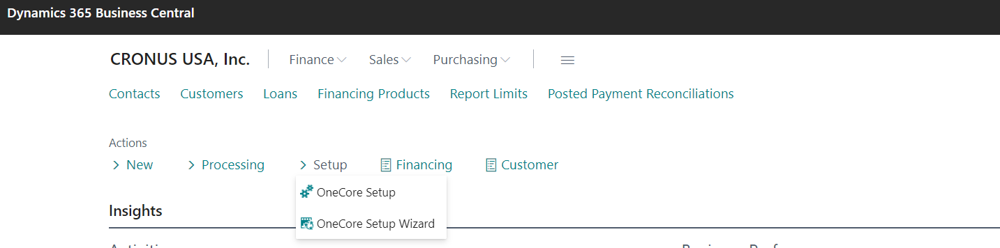
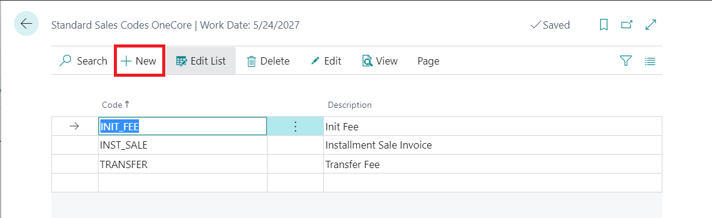
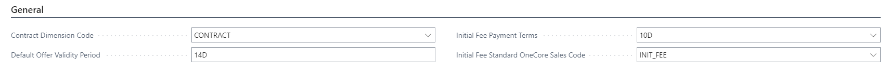
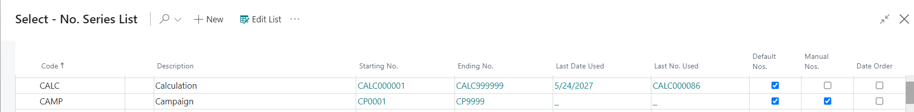

# OneCore Setup

In OneCore Setup you manage the basic conditions and terms such as posting, guarantee types, contract documents, branches, contract transfer reasons, sale codes, numbering, non-working days, public holidays and withdrawal slips. 

The setup could be done by the wizard or manually from Setup menu.

There are 2 parts of OneCore Setup - From the [upper menu section](#onecore-setup-upper-menu-section) and [card sections](#onecore-setup-card-section).

# OneCore setup upper menu section 

__1) OneCore Posting Setup__ 

The posting setting is described [here](SetUp_Posting.md).

__2) Guarantee types__

The list of Guarantee types used in financing contract. All guarantees which are set up in this section, you can choose during the process of the loan creating.  New types are added by button __New__.

__3) Contract Documents__

It is possible to set up the workflow process according to which document from which customer (Legal Entity, Individual Non-Entrepreneur, Individual Entrepreneur) and in which contract status is needed to approve the contract. 

__4) Branches__

The list of Internal or External branches of your company.

__5) General Terms and Conditions__

__6) Contract Transfer Reasons__

The contract could be transfered from different reasons (as insolvency, takeover, death,..). There is the list of these reasons. The new one could be added by the button __New__.

__7) Standard Sale Codes OneCore__.

# OneCore setup card section 

__1) General__

- __Contract Dimension Code__ - to set up Dimension in financing contract e.g. CONTRACT

- __Default Offer Validity Period__ - how long is the offer valid

- __Initial Fee Payment Terms__ - Default Payment Term for the Initial Fee Invoice

- __Initial Fee Standard OneCore Sales Code__ - Default Sales Code for the Initial Fee Invoice

__2) Numbering__

The numbering of Contracts allows you to use default values or change the numbers codes in Calculation status and Guarantees for contract. 

It is done in "No. Series List" table where you can create new series number for documents by button __New__. 

It is neccesary to set up by making the selection active if the numbering of documents (No. Series) would be done automatically by the system - __Default Nos.__ or manually __Manual Nos.__.

- __Starting No.__ - it is used for first document number. If the numbering is "Default Nos" the system will automatically increments the document number by one.

- __Ending No.__ - if it is filled the system notifies you of the ending series. 

__3) Contract Transfer__

__4) Non-working days__

The system offers you the possibility to setup:
- working and non-working days 
- all public holidays 

to calculate Due Date in Payment calendar as first working day after standard calculated Due Date according to the Contract payment term. To set up non-working days, put button __on__. To set up holidays, choose exact day from the calendar and write short description (as 1/1/2022 - New Year)

__5) Withdrawal Slip__

For posting drawing of the Loan, the Credit memo feature is used. It must be filled "General Journal Template", "General Journal Batch" and "Temp Receivable Account" as G/L account for clearing.

 __[Back to Getting Started](1_GettingStarted.md)__ 
