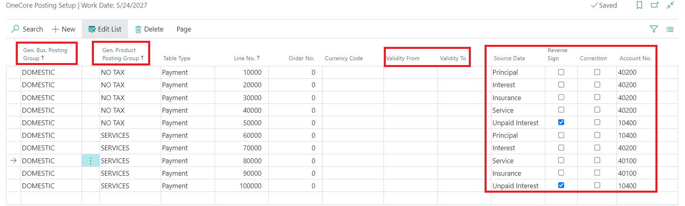
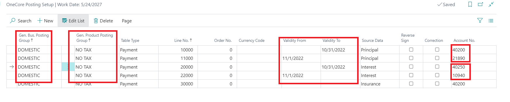
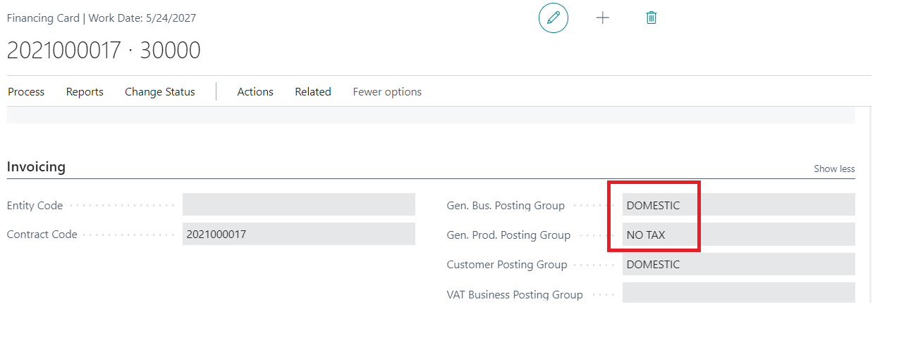
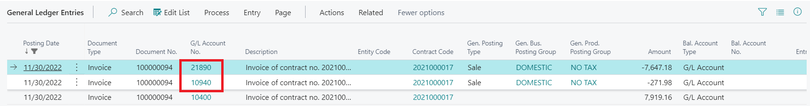
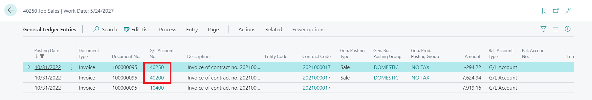

# Posting Setup
##
It is necessary to set up the postings to G/L accounts where Loan repayments (Principal, Interest, Services, Insurance) should be posted. The selected account will be result of the Gen.Bus Posting Group a Gen.Prod. Posting Group combination. The combination could be time limited. 

The posting groups are defined in Financing product card and can be edited in calculation status in Financing Contract Card or Finanicing produkt card. It means that every loan could be posted to different G/L accounts according to filled __[Posting groups](#postinggroups)__ in Financing Contract Card.

Check the [Example of the Posting Setup](#exampple-posting-setup) bellow.

# Posting Groups

  The posting groups map entities such as customers, vendors, items, resources, and sales and purchase documents to general ledger accounts. It saves time and helps avoid mistakes when you post transactions. The transaction values go to the accounts specified in the posting group for that particular entity. The only requirement is that you have a chart of accounts. More details __[here](https://docs.microsoft.com/en-us/dynamics365/business-central/finance-posting-groups)__. 

# Example Posting Setup

OneCore posting setup diferent postings till 31.10.2022 and from 1.11.2022 for selected posting groups:

Selected posting groups in the contract:

Posting contract repayment till 31.10.2022:

Posting contract repayment from 1.11.2022:

 __[Back](SetUp_GettingStartedWithLoansExpress.md)__ 

